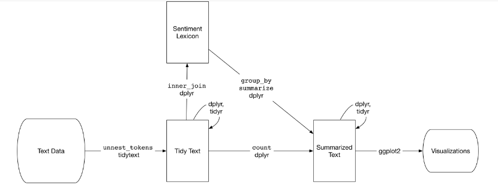

## Using TidyText to perform sentiment analysis

```{r}
library(tidytext)
library(textdata)
library(magritter)
library(dplyr)
library(stringr)
library(glue)
library(tidyverse)
library(tidyr)
library(ggplot2)
library(gutenbergr)
```

Now we will create a 'words' vector that goes through the standard tidytext process of uploading a text file, creating a dataframe of words and row numbers, and tokenizing the words in the text file.

```{r}
alice_words <- tibble(file = paste0('corpus/c19-20_prose/carroll_alice.txt')) %>%
  mutate(text = map(file, read_lines)) %>%
  unnest() %>%
  group_by(file = str_sub(basename(file), 1, -5)) %>%
  mutate(line_number = row_number()) %>%
  ungroup() %>%
  unnest_tokens(word, text)

alice_words

alice_words$word[5:25]
```

Next you invoke the 'inner_join' function which is essentially a way of conflating (or comparing) a data set against another. This is much easier to accomplish when the data is in tidy format. Here we are joining the text data from Lewis Carrol's *Alice in Wonderland* with a dictionary of sentiment words that assigns positive or negative values to each word.

```{r}
alice_words_sentiment <- inner_join(alice_words,
                              get_sentiments("bing")) %>%
  count(file, index = round(line_number/ max(line_number) * 100 / 5) * 5, sentiment) %>%
  spread(sentiment, n, fill = 0) %>%
  mutate(net_sentiment = positive - negative)
```

Did you notice the `get_sentiments` function? What is happening is that you are calling an `inner_join` function that includes an instruction to compare the tidy words tibble to a sentiment dictionary called "bing." Let's have a look at this.

```{r}
get_sentiments("bing")
```

We get a binary sentiment result (positive or negative). Another useful dictionary (probably better for more complex or historical texts) is "aFinn".
```{r}
get_sentiments("afinn")
```

Here we get a range of sentiment values. The other dictionary called `nrc`, offers a binary one with 'yes' or 'no' values, with corresponding categories, if 'yes'.

```{r}
get_sentiments("nrc")
```


Silge and Robinson provide a useful flowchart of how this works.



Back to our results: Using the ggplot library, we can visualise the results. 

```{r}
alice_words_sentiment %>% ggplot(aes(x = index, y = net_sentiment, fill = file)) + 
  geom_bar(stat = "identity", show.legend = FALSE) + 
  facet_wrap(~ file) + 
  scale_x_continuous("Location in the volume") + 
  scale_y_continuous("Bing net Sentiment")
```

Let's make this interesting by comparing these results to another children's author from our corpus. 

```{r}
edgeworth_words <- data_frame(file = paste0('corpus/c19-20_prose/edgeworth_parents.txt')) %>%
  mutate(text = map(file, read_lines)) %>%
  unnest() %>%
  group_by(file = str_sub(basename(file), 1, -5)) %>%
  mutate(line_number = row_number()) %>%
  ungroup() %>%
  unnest_tokens(word, text)

edgeworth_words_sentiment <- inner_join(edgeworth_words,
                                                 get_sentiments("bing")) %>%
  count(file, index = round(line_number/ max(line_number) * 100 / 5) * 5, sentiment) %>%
  spread(sentiment, n, fill = 0) %>%
  mutate(net_sentiment = positive - negative)

edgeworth_words_sentiment %>% ggplot(aes(x = index, y = net_sentiment, fill = file)) + 
  geom_bar(stat = "identity", show.legend = FALSE) + 
  facet_wrap(~ file) + 
  scale_x_continuous("Location in the volume (by percentage)") + 
  scale_y_continuous("Bing net sentiment of Edgworth's Parents...")

```

Clearly Lewis Carrol's *Alice* is more sinister on the single-word level. Let's break down the Carrol results into more understandable graphs.

```{r}
alice.bing_word_counts <- alice_words %>%
  anti_join(custom_stop_words) %>%
  inner_join(get_sentiments("bing")) %>%
  count(word, sentiment, sort = TRUE) %>%
  ungroup()

alice.bing_word_counts <- alice.bing_word_counts %>%
  group_by(sentiment) %>%
  top_n(20) %>%
  ungroup() %>%
  mutate(word = reorder(word, n)) %>%
  ggplot(aes(word, n, fill = sentiment)) +
  geom_col(show.legend = FALSE) +
  facet_wrap(~sentiment, scales = "free_y") +
  labs(y = "Word Frequency of Sentiment Words in Lewis Carrol's Alice",
       x = NULL) +
  coord_flip()

alice.bing_word_counts
```
You may notice that the top negative word is likely wrong: "miss," which probably refers to the indefinite unmarried woman. You could create a custom stop word list to filter out words that you do not want.

```{r}
custom_stop_words <- bind_rows(tibble(word = c("miss", "mock", "like"), lexicon = c("custom")), 
                               stop_words)

custom_stop_words
```


Let try this with another sentiment dictionary.


```{r}
alice.nrc_word_counts <- alice_words %>%
  anti_join(custom_stop_words) %>%
  inner_join(get_sentiments("nrc")) %>%
  count(word, sentiment, sort = TRUE) %>%
  ungroup()

alice.nrc_word_counts %>% 
  group_by(sentiment) %>%
  top_n(20) %>%
  ungroup() %>%
  mutate(word = reorder(word, n)) %>%
  ggplot(aes(word, n, fill = sentiment)) +
  geom_col(show.legend = FALSE) +
  facet_wrap(~sentiment, scales = "free_y") +
  labs(y = "Word Frequency of Sentiment Words in Lewis Carrol's Alice",
       x = NULL) +
  coord_flip()
```

Here we have different categories of sentiment words, and it seems to be more accurate than the bing calculations. 

We can also use the tidy `filter()` function to focus on a specific category of sentiment.

```{r}
nrc_joy <- get_sentiments("nrc") %>% 
  filter(sentiment == "joy")

alice.joy.word.counts <- alice_words %>%
  inner_join(nrc_joy) %>% # here we can just inner_join with our new nrc_joy variable
  count(word, sentiment, sort = TRUE) %>%
  ungroup()

alice.joy.word.counts
```


You can use the code below to combine the two sentiment dictionary results in an overall trajectory.

```{r}
bing_and_nrc <- bind_rows(alice_words %>% 
  inner_join(get_sentiments("bing")) %>%
  mutate(method = "Bing"),
  alice_words %>% 
  inner_join(get_sentiments("nrc") %>% 
  filter(sentiment %in% c("positive", "negative"))) %>%
  mutate(method = "NRC")) %>%
  count(method, index = line_number %/% 80, sentiment) %>%
  spread(sentiment, n, fill = 0) %>%
  mutate(sentiment = positive - negative)

bing_and_nrc %>%
  ggplot(aes(index, sentiment, fill = method)) +
  geom_col(show.legend = FALSE) +
  facet_wrap(~method, ncol = 1, scales = "free_y")
```

As you can see the bing dictionary generally scores the text more negatively than the nrc. Let's now compare this to Edgeworth.  

```{r}
edg.nrc_word_counts <- edgeworth_words %>%
  inner_join(get_sentiments("nrc")) %>%
  count(word, sentiment, sort = TRUE) %>%
  ungroup()

edg.nrc_word_counts %>%
  group_by(sentiment) %>%
  top_n(20) %>%
  ungroup() %>%
  mutate(word = reorder(word, n)) %>%
  ggplot(aes(word, n, fill = sentiment)) +
  geom_col(show.legend = FALSE) +
  facet_wrap(~sentiment, scales = "free_y") +
  labs(y = "Word Frequency of Sentiment Words in Edgeworth",
       x = NULL) +
  coord_flip()
summary(bing_word_counts)
```

Another way to re-orient the sentiment results is to create a word cloud. Sometimes these can be useful for assessing the total weight of positivity or negativity in a text.

```{r message=FALSE}
library(wordcloud)
library(reshape2)

# create a sentiment wordcloud of the Edgeworth results

edgeworth_words %>%
  inner_join(get_sentiments("bing")) %>%
  count(word, sentiment, sort = TRUE) %>%
  acast(word ~ sentiment, value.var = "n", fill = 0) %>%
  comparison.cloud(max.words = 1000, scale = c(1,.25), 
                   random.order = FALSE,
                   colors = c("red", "blue"))
```

As you can see, the cloud displays the overall negativity that the line graph above suggested. Let's see how that compares to Herodotus.

```{r message=FALSE}
library(wordcloud)
library(reshape2)

alice_words %>%
  inner_join(get_sentiments("bing")) %>%
  count(word, sentiment, sort = TRUE) %>%
  acast(word ~ sentiment, value.var = "n", fill = 0) %>%
  comparison.cloud(max.words = 1000, scale = c(1,.25), 
                   random.order = FALSE,
                   colors = c("red", "blue"))
```

```{r}
# for a comparison, create a sentiment wordcloud of the Alice results using the afinn dictionary
get_sentiments("afinn")

alice_words %>%
  inner_join(get_sentiments("afinn")) %>%
  count(word, value, sort = TRUE) %>% # notice here that you're calling on a different observation ("value") instead of the "sentiment" in the previous example: that's due to the tibble structure of the dictionary
  acast(word ~ value, value.var = "n", fill = 0) %>%
  comparison.cloud(max.words = 1000, scale = c(1,.25), 
                   random.order = FALSE,
                   colors = c("red", "blue"))
```

### Accessing more context: 2-n gram frequencies

```{r}
alice_bigrams <- alice_words %>%
  unnest_tokens(bigram, word, token = "ngrams", n = 2)
alice_bigrams %>%
  count(bigram, sort = TRUE)

# use separate function to filter out stopwords
bigrams_sep <- alice_bigrams %>%
  separate(bigram, c("word1", "word2"), sep = " ")

bigrams_filtered <- bigrams_sep %>%
  filter(!word1 %in% stop_words$word) %>%
  filter(!word2 %in% stop_words$word)

# new bigram counts with substantive words
sub_bigram_counts <- bigrams_filtered %>%
  count(word1, word2, sort = TRUE)

sub_bigram_counts
```


```{r}
# calculate tri-grams
alice_trigrams <- alice_words %>%
  unnest_tokens(trigram, word, token = "ngrams", n = 3) %>%
  separate(trigram, c("word1", "word2", "word3"), sep = " ") %>%
  filter(!word1 %in% stop_words$word,
  !word2 %in% stop_words$word,
  !word3 %in% stop_words$word) %>%
  count(word1, word2, word3, sort = TRUE)

alice_trigrams
```

### Using bigrams to provide contextual sentiment

```{r}
bigrams_sep %>%
  filter(word1 == "not") %>%
  count(word1, word2, sort = TRUE)
```


```{r}
AFINN <- get_sentiments("afinn")

not_words <- bigrams_sep %>%
  filter(word1 == "not") %>%
  inner_join(AFINN, by = c(word2 = "word")) %>%
  count(word2, value, sort = TRUE) %>%
  ungroup()

not_words
```


```{r}
not_words %>%
  mutate(contribution = n * value) %>%
  arrange(desc(abs(contribution))) %>%
  head(20) %>%
  mutate(word2 = reorder(word2, contribution)) %>%
  ggplot(aes(word2, n * value, fill = n * value > 0)) +
  geom_col(show.legend = FALSE) +
  xlab("Words preceded by \"not\"") +
  ylab("Sentiment score * number of occurrences") +
  coord_flip()

# run dev.off() if you get a graphics error
```


Now let's add to this by accounting for negation words.

```{r}
negation_words <- c("not", "no", "never", "without")

negated_words <- bigrams_sep %>%
  filter(word1 %in% negation_words) %>%
  inner_join(AFINN, by = c(word2 = "word")) %>%
  count(word1, word2, value, sort = TRUE) %>%
  ungroup()
```


```{r}
negated_words %>%
  mutate(contribution = n * value) %>%
  arrange(desc(abs(contribution))) %>%
  head(25) %>%
  mutate(word2 = reorder(word2, contribution)) %>%
  ggplot(aes(word2, n * value, fill = n * value > 0)) +
  geom_col(show.legend = FALSE) +
  xlab("Words preceded by a negation") +
  ylab("Sentiment score * number of occurrences") +
  coord_flip()
```


## Exercise 3

1. Load your own texts (either from your our corpus or from a digital repository like or Project Gutenberg).

2. Posit a new question--or questions--about what you would like to investigate further. 

3. Modify a code block(s) from the R Notebook to answer your question.

```{r}

```


## Publish your results

When you save the notebook, an HTML file containing the code and output will be saved alongside it (click the *Preview* button or press *Cmd+Shift+K* to preview the HTML file).

If you are interested in learning more about R and corpus linguistics, in addition to Silge and Robinson and Jockers, you could also consult R. H. Baayen's *Analyzing Linguistic Data: A practical introduction to statistics* (Cambridge UP, 2008) and Stefan Gries's *Quantitative Corpus Linguistics with R*, 2nd ed. (Routledge, 2017).

Some good web resources include Jeff Rydberg-Cox's [Introduction to R](https://daedalus.umkc.edu/StatisticalMethods/index.html) and David Silge and Julia Robinson's [*Text Mining with R*](https://www.tidytextmining.com/). Also be sure to examine the [CRAN R Documentation site](https://cran.r-project.org/doc/manuals/R-intro.html).

