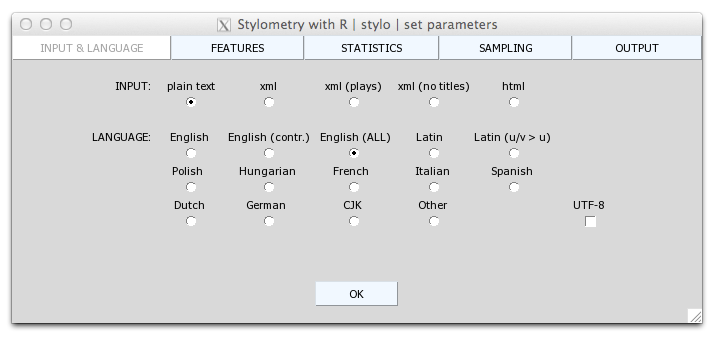

# Stylometry and Text Analysis

## Installing stylo
- run RStudio (or the R console)
- in the Console, type install.packages("stylo"); or, find "Packages" in the lower-right pane, then click "Install," and type "stylo" and click "Install."
- click Enter

```{r}
library(stylo)
```


## Installation issues

**NOTE** (Mac OS users): the package stylo requires the installation of X11 support. (See http://cran.r-project.org/bin/macosx/RMacOSX-FAQ.html: “Each binary distribution of R available through CRAN is build to use the X11 implementation of Tcl/Tk. Of course a X windows server has to be started first: this should happen automatically on OS X, provided it has been installed (it needs a separate install on Mountain Lion or later). The first time things are done in the X server there can be a long delay whilst a font cache is constructed; starting the server can take several seconds”.)

You may also need to download XQuart at https://www.xquartz.org/.

- Install XQuartz, restart Mac
- Open Terminal, type: sudo ln -s /opt/X11 /usr/X11
- Run XQuartz
- Run R, type: system('defaults write org.R-project.R force.LANG en_US.UTF-8')

On MacOS Mojave one usually faces the problem of not properly recognized tcltk support. Open your terminal and type the following command:

`xcode-select --install`.

This will download and install xcode developer tools and fix the problem. The problem is that one needs to explicitly agree to the license agreement.

You might also run into encoding errors when you start up R (e.g. “WARNING: You’re using a non-UTF8 locale” etc.). In that case, you should close R, open a new window in Applications > Terminal and execute the following line:

`defaults write org.R-project.R force.LANG en_US.UTF-8`.

Next, close the Terminal and start up R again.

See more at https://github.com/computationalstylistics/stylo.

## Activate Stylo

The main function is a single function: `stylo()`. This only works, though, if you have already set up a corpus (which is titled "corpus").

Download the stylo corpus [here](https://www.dropbox.com/sh/n1tep3om866esa9/AABXfmK8syaAyXCjZ-ESKY2Za?dl=0). Make sure you have saved it to your Desktop, along with the R notebook. It contains works by Mark Twain and Charles Dudley Warner (more on why later).

It computes distances (differences) between texts which are converted into rows of frequencies of most frequent words (MFW).

Then it plots graphs of those distances:
- Cluster Analysis plots (dendrograms)
- Multidimensional Scaling scatterplots
- Principal Components Analysis scatterplots
- Bootstrap Consensus Trees plots (for multiple parameter settings)
- Bootstrap Consensus Networks (other software will be needed to take over)

The plots can be both displayed on screen and saved to a file (e.g. PNG).

# stylo GUIs

The package currently has two graphical user interfaces (GUI). One creates static visualisations of stylometric results, and the other creates a dynamic network graph that represents the distance measurements. 

```{r}
stylo()
```

What should pop up is the following stylo GUI:



For your first experiment you should just click "OK" and see what happens.

The default settings use the ratios of the 100 most frequent words, Classic Delta distance measure, and Ward clustering algorithm to produce a hierarchical clustering dendrogram (think of it as akin to a stylistic family tree).

Other distance measurements and text paramters can be defined in the GUI. But the GUI is not necessary; one can also use the stylo function with various arguments.

```{r}
# this function activates an already-existing dataset:
data(lee)
# this funcion launches the analysis with pre-defined parameters:
stylo(frequencies = lee, analysis.type = "BCT", 
    mfw.min = 100, mfw.max = 3000, custom.graph.title = "Harper Lee",
    write.png.file = TRUE, gui = FALSE)
```

Run the chunk below to get the GUI for the network function, which outputs a bootstrap consensus network. Make sure you have installed the "networkD3" package before executing this code.

```{r}
stylo.network()
```

The relative distances are now mapped on a web browser and can be saved as html files for later use.

## Corpus ingestion and analysis

In the corpus dircetory above, I have included a subdirectory including by Mark Twain and Charles Dudley Warner. The reason for this is that they were near contemporaries and friends, and they co-wrote a novel called *The Gilded Age*. We are going to run stylo experiments to investigate the differences between the two authors.

```{r}
my.corpus <- load.corpus.and.parse(corpus.dir = "corpus/corpus-mt-and-cdw/", markup.type = "text", ngram.size = 1)
```

```{r}
mt.cdw.freq.l <- make.frequency.list(my.corpus, value = FALSE, head = NULL,
                    relative = TRUE)

# this generates a word frequency list for the entire corpus
```


```{r}

#these two simple lines of code automatically generate relative frequencies based on the above frequency list

words = txt.to.words.ext(my.corpus)

mt.cdw.rel.freq.t <- make.frequency.list(words, value = TRUE)

mt.cdw.rel.freq.t[1:10]
```

```{r}
make.samples(words, sampling = "normal.sampling", sample.size = 50)
```


```{r}
complete.word.list = make.frequency.list(words)

make.table.of.frequencies(words, complete.word.list)
```

```{r}
mt.cdw.table <- write.csv(make.table.of.frequencies(words, complete.word.list), "mark-twain-warner-table.csv")
#this outputs all of the work-based relative frequency data into a csv file
```

```{r}
tokenized.corpus <- txt.to.words.ext(my.corpus, language = "English.all",
                                     preserve.case = FALSE)

summary(tokenized.corpus)
```

```{r}
sliced.corpus <- make.samples(tokenized.corpus, sampling = "normal.sampling",
                              sample.size = 100)
frequent.features <- make.frequency.list(sliced.corpus)

frequent.features[1:50]

frequent.features[100:150]
```


## More stylo code

```{r}
stylo.results <- stylo()
```

```{r}
stylo.results$features[1:100]
```

```{r}
stylo.results$distance.table
```


## Craig's zeta comparison

Craig's zeta will allow you to compare two data sets based on juxtaposing word preferences. In order to do this you need to create subdirectories within the `corpus` called `primary_set` and `secondary_set`. Copy the Mark Twain texts into the primary set, and the Warner into the secondary one.

```{r}
corpus <- as.data.frame("corpus/")

corpus.all <- txt.to.words.ext(corpus, language = "English.all",
                               preserve.case = TRUE) 
corpus.mt <- corpus.all[grep("twain", names(corpus.all))]
corpus.cdw <- corpus.all[grep("warner", names(corpus.all))]

zeta.results <- oppose(primary.corpus = corpus.mt,
                       secondary.corpus = corpus.cdw, gui = TRUE)
# In the GUI, navigate to the corpus folder, in which you have put primary_set and secondary_set
```

This outputs a list of preferred and avoided words by the texts in the primary set (Mark Twain).

```{r}
zeta.results$words.preferred[1:20]

zeta.results$words.avoided[1:20]
```

So, what is distinctly Mark Twain and what is Warner-esque?

## Other useful functions 

For performing supervised machine-learning analyses, including Burrows’s Delta, Support Vector Machines, and so forth:

```{r}
classify()
```

Performing contrastive analyses of two subcorpora:

```{r}
oppose()
# in the GUI I have chosen Craig's zeta, which was used above, except I have checked the boxes for visualising differences: "Markers" and "Identify Points".
```


What can you gather from here about the probability of majority authorship?

Rolling Stylometry technique (which slices an input text into equal-sized samples and compares them sequentially with reference data; it is good at finding local idiosyncrasies in longer texts). It can also analyse collaborative works and try to determine the authorship of fragments extracted from them. This requires that the working directory contains two subdirectories: "reference_set" and "test_set."

```{r}
rolling.classify(write.png.file = TRUE, mfw = 100, training.set.sampling = "normal.sampling", slice.size = 5000, slice.overlap = 4500)
```
What you're seeing is a series of "windows" of the test text as against the reference texts. By “windowing” I mean that each reference text is divided into consecutive, equal-sized samples. It employs the relative frequencies of a (preferably small) set of n words which were also frequent in the reference collection. As Eder et al suggest, " If the curve for a text would show a sudden drop at a given position, this could be indicative of a stylistic change in the text (which might, for instance, be caused by one author taking over from another."

The vertical lines in the plot can be thought to mark the position of certain events in the test text, either a change in chapter or a change in style.

To learn more about stylo, consult [Eder, Rybicki, and Kestemont's documentation](https://4bc8d809-a-62cb3a1a-s-sites.googlegroups.com/site/computationalstylistics/stylo/stylo_howto.pdf?attachauth=ANoY7coDX7i5IQiUFMzj3t5plryJdzEX6HalsOFNYcY0MuEkRjEcgRdxintmXDmiTmrk9iiKOLNf_u-sXgosAnlG75tz1USWfoHiNe4rhFuFjoyqPfPaFIb3W4q63VxJ3a4Etpec8SMrqdMRMvkeApHeHzPNO3zvvUwmieVvBW3H68wOsWG2ZRRc4_nO0rM5dm2cb4obSiqjRe4_-VaDfN2vshvxBf_fwtvvzmzQGpCH5U9hnvTQb-M%3D&attredirects=0).